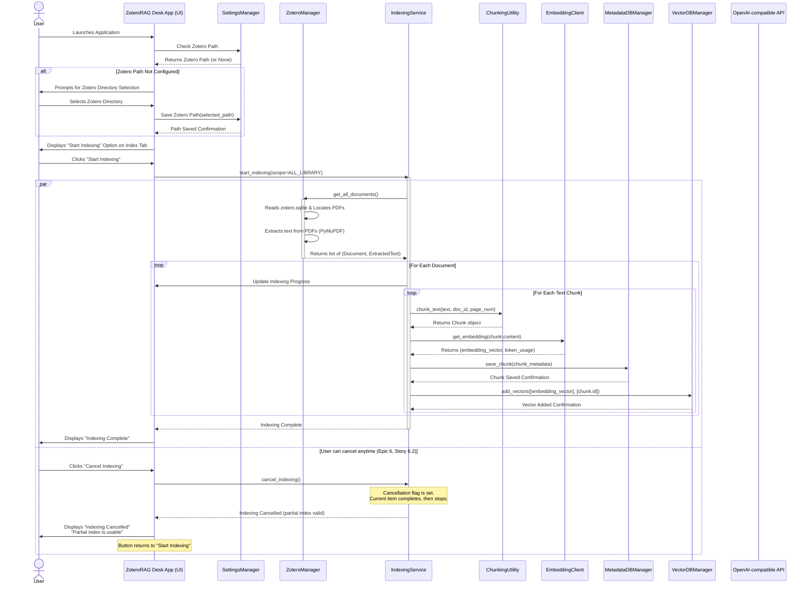
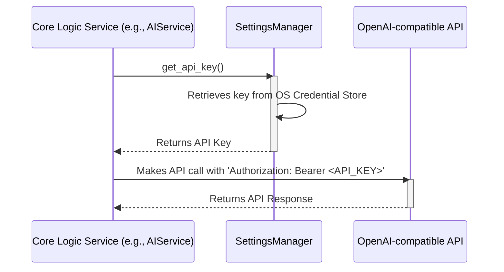
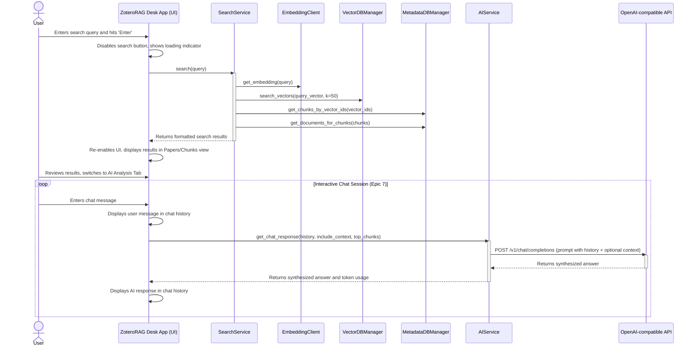

# ZoteroRAG Desk Fullstack Architecture Document

## Introduction

This document outlines the complete fullstack architecture for ZoteroRAG Desk, including backend systems, frontend implementation, and their integration. It serves as the single source of truth for AI-driven development, ensuring consistency across the entire technology stack.

This unified approach combines what would traditionally be separate backend and frontend architecture documents, streamlining the development process for modern fullstack applications where these concerns are increasingly intertwined.

### Starter Template or Existing Project

N/A - This is a greenfield project. The architecture will be designed from the ground up based on the technical requirements and assumptions outlined in the Product Requirements Document (PRD).

### Change Log

| Date | Version | Description | Author |
| :--- | :--- | :--- | :--- |
| 2025-11-22 | 0.3 | Updated architecture for Epics 7, 8, and 9. Introduces chat-based AI, enhanced indexing UX, and reorganized search UI. | Winston (Architect) |
| 2025-11-22 | 0.2 | Updated architecture to align with PRD v1.1, incorporating major UI/UX enhancements including a tabbed interface, indexing cancellation, and improved results display. | Winston (Architect) |
| 2025-11-19 | 0.1 | Initial draft based on PRD v1.0. | Winston (Architect) |

## High Level Architecture

### Technical Summary

ZoteroRAG Desk is architected as a **monolithic, cross-platform desktop application** designed to run locally on the user's machine (Windows, macOS, and Linux). The architecture prioritizes privacy and safety by keeping all user data, including the semantic index, on the local file system. The user interface is built with **PySide6**, and the core application logic is written in **Python**. These two layers operate within a single process, ensuring a simple and responsive user experience. Cloud services, specifically an OpenAI-compatible API, are used only on an opt-in, Bring-Your-Own-Key (BYOK) basis for embedding generation and AI synthesis, ensuring no user data is processed without explicit consent.

### Platform and Infrastructure Choice

The application follows a **local-first** paradigm. The primary platform is the user's own desktop computer.

*   **Platform:** User's local machine (Windows, macOS, Linux).
*   **Key Services (Local):**
    *   **File System:** For storing the application, its configuration, and the generated index.
    *   **SQLite:** For reading the Zotero database and storing local metadata for text chunks.
    *   **FAISS:** For storing and searching local vector embeddings.
    *   **OS Credential Manager:** For securely storing the user's API key.
*   **Key Services (Cloud):**
    *   **OpenAI-compatible API:** For generating text embeddings and performing AI synthesis (BYOK).
*   **Deployment Host and Regions:** Not applicable, as the application is deployed and runs directly on the user's machine.

### Repository Structure

As specified in the PRD, the project will use a **monorepo** structure. This simplifies dependency management and the build process for the monolithic desktop application.

*   **Structure:** Monorepo (single Git repository).
*   **Monorepo Tool:** Not applicable (Python-native project structure is sufficient).
*   **Package Organization:** The code will be organized into logical packages within a `src` directory, separating concerns like `ui`, `core_logic`, `data_access`, and `services`.

### High Level Architecture Diagram

```mermaid
graph TD
    subgraph User's Machine
        User -- Interacts with --> App_GUI[Desktop App GUI<br>(PySide6)]

        subgraph ZoteroRAG Desk Application
            App_GUI -- Calls --> Core_Logic[Core Logic<br>(Python Services)]
            Core_Logic -- Manages --> Indexing_Service[Indexing Service]
            Core_Logic -- Manages --> Search_Service[Search Service]
            Core_Logic -- Manages --> Analysis_Service[AI Analysis Service]
        end

        subgraph Local Data Storage
            Indexing_Service -- Reads --> Zotero_DB[Zotero DB<br>(zotero.sqlite)]
            Indexing_Service -- Reads --> PDFs[PDF Files<br>(storage/)]
            Indexing_Service -- Writes to --> Metadata_DB[Metadata DB<br>(SQLite)]
            Indexing_Service -- Writes to --> Vector_DB[Vector Index<br>(FAISS)]

            Search_Service -- Reads from --> Metadata_DB
            Search_Service -- Reads from --> Vector_DB
        end
    end

    subgraph Cloud (Optional, BYOK)
        Analysis_Service -- Sends Query + Chunks --> OpenAI_API[OpenAI-compatible API]
        Indexing_Service -- Sends Chunks --> OpenAI_API
        OpenAI_API -- Returns Embeddings/Analysis --> Core_Logic
    end

    style Zotero_DB fill:#f9f,stroke:#333,stroke-width:2px
    style PDFs fill:#f9f,stroke:#333,stroke-width:2px
```

### Architectural Patterns

*   **Monolithic Desktop Application:** The entire application is a single, self-contained unit.
    *   *Rationale:* Simplifies development, deployment, and maintenance for a local-first utility, as specified in the PRD.
*   **Model-View-Controller (MVC):** The UI (View) will be separated from the business logic (Controller) and data (Model).
    *   *Rationale:* This classic pattern promotes separation of concerns within the monolithic structure, making the PySide6 GUI code more maintainable and testable.
*   **Service Layer:** Business logic for indexing, searching, and analysis will be encapsulated in dedicated service classes.
    *   *Rationale:* Decouples the core logic from the UI and data access layers, improving modularity.
*   **Repository Pattern:** Data access for all local storage (Zotero DB, Metadata DB, FAISS index) will be abstracted behind repository classes.
    *   *Rationale:* Isolates data storage details, allowing for easier testing (mocks) and potential future changes to the storage mechanism.

*   **Secure Storage:** The primary security concern is the user's API key. This will be handled exclusively by the `SettingsManager`, which will use the native OS credential manager (e.g., Windows Credential Manager, macOS Keychain) via the `keyring` library. The key will never be stored in plain text files.
*   **Local Data at Rest Encryption:** For the MVP, the application will rely on the operating system's native encryption capabilities (e.g., BitLocker, FileVault, LUKS) for protecting local data at rest (SQLite databases, FAISS index, PDF files). Application-level encryption for these data stores is not planned for the MVP due to complexity and potential performance overhead, but can be considered in future iterations if a higher security profile is required.

## Tech Stack

### Technology Stack Table

| Category | Technology | Version | Purpose | Rationale |
| :--- | :--- | :--- | :--- | :--- |
| Frontend Language | Python | 3.13+ | Primary language for the entire application. | Explicitly stated in PRD. |
| Frontend Framework | PySide6 | Latest Stable | GUI framework for cross-platform desktop application. | Explicitly stated in PRD. |
| UI Component Library | PySide6 Widgets | Latest Stable | Native UI components provided by PySide6. | Integrated with PySide6, provides native look and feel. |
| State Management | Internal Event/Observer Pattern | N/A | Manage application state and UI updates within the desktop app. | Simple, effective for monolithic desktop apps, avoids external dependencies. |
| Backend Language | Python | 3.13+ | Primary language for all core logic. | Explicitly stated in PRD. |
| Backend Framework | N/A - Integrated Logic | N/A | Core logic is integrated directly into the desktop application, not a separate server. | Monolithic desktop application architecture. |
| API Style | Internal Python API / External REST | N/A | Internal: Python function calls between GUI and core logic. External: REST for cloud embeddings. | Standard approach for desktop apps; external for specified cloud services. |
| Database | SQLite | Latest Stable | Local storage for Zotero DB (read-only) and application metadata. | Explicitly stated in PRD; lightweight, embedded, local-first. |
| Database | FAISS | Latest Stable | Local vector database for semantic search. | Explicitly stated in PRD; efficient similarity search. |
| Cache | N/A | N/A | Local-first design with direct data access minimizes need for separate caching layer. | Simplicity for MVP. |
| File Storage | Local File System | N/A | Storing PDFs, application data, and index files. | Core to local-first, privacy-centric design. |
| Authentication | BYOK API Key (External) | N/A | User-provided API key for external cloud services, stored securely. | PRD requirement for optional cloud features. |
| Frontend Testing | Pytest / PySide6 Test Utils | Latest Stable | Unit and integration testing for GUI components and interactions. | Standard Python testing framework with GUI-specific extensions. |
| Backend Testing | Pytest | Latest Stable | Unit and integration testing for core logic and data access. | Standard, flexible, and widely adopted Python testing framework. |
| E2E Testing | Pytest + UI Automation Library (e.g., `pytest-qt`) | Latest Stable | End-to-end testing of the full application workflow. | Ensures full system functionality across UI and logic. |
| Build Tool | PyInstaller | Latest Stable | Packaging Python application into standalone executables. | Explicitly stated in PRD for cross-platform distribution. |
| Bundler | PyInstaller | Latest Stable | Handles bundling Python dependencies and assets. | Integrated with PyInstaller for self-contained executables. |
| IaC Tool | N/A | N/A | Desktop application, no cloud infrastructure to manage via IaC. | Local-first architecture. |
| CI/CD | GitHub Actions | N/A | Automated build, test, and packaging for cross-platform releases. | Common, flexible, and free for open-source projects. |
| Monitoring | Python `logging` module | N/A | Local application logging for diagnostics and error tracking. | Simple, built-in, and sufficient for a desktop application. |
| Logging | Python `logging` module | N/A | Structured logging with levels (DEBUG, INFO, WARNING, ERROR, CRITICAL). Logs stored in app data directory with rotation (10MB max, 7-day retention). | Standard, flexible, and widely adopted Python logging. |
| CSS Framework | N/A (Qt Styling Sheets) | N/A | PySide6 uses Qt Styling Sheets for UI customization, not traditional web CSS frameworks. | Native GUI framework approach. |

## Data Models

### Document

**Purpose:** Represents a single source document (e.g., a PDF) from the user's Zotero library, storing its essential metadata.

**Key Attributes:**
*   `id`: `int` - The unique identifier for the document in our local database.
*   `zotero_item_key`: `str` - The key of the item in the Zotero database, for cross-referencing.
*   `title`: `str` - The title of the document.
*   `authors`: `list[str]` - A list of the document's authors.
*   `year`: `int` - The publication year.
*   `pdf_file_path`: `str` - The absolute file path to the PDF.
*   `indexed_at`: `datetime` - The timestamp of when the document was last indexed.
*   `indexing_status`: `str` - The current indexing status ('not_indexed', 'indexed', 'no_pdf', 'pdf_error').

#### Python Dataclass
```python
from dataclasses import dataclass
from datetime import datetime

@dataclass
class Document:
    id: int
    zotero_item_key: str
    title: str
    authors: list[str]
    year: int
    pdf_file_path: str
    indexed_at: datetime
    indexing_status: str
```

#### Relationships
*   Has a one-to-many relationship with `Chunk`.
*   Has a many-to-many relationship with `Collection` (via the `DocumentCollection` link table).

---
### Chunk

**Purpose:** Represents a small, searchable segment of text extracted from a `Document`. This is the unit of retrieval for semantic search.

**Key Attributes:**
*   `id`: `int` - The unique identifier for the chunk in our local database.
*   `document_id`: `int` - A foreign key linking this chunk back to its parent `Document`.
*   `content`: `str` - The actual text content of the chunk.
*   `page_number`: `int` - The page number in the source PDF where this chunk originates.
*   `vector_id`: `int` - The ID of this chunk's embedding within the FAISS vector index.

#### Python Dataclass
```python
from dataclasses import dataclass

@dataclass
class Chunk:
    id: int
    document_id: int
    content: str
    page_number: int
    vector_id: int
```

#### Relationships
*   Has a many-to-one relationship with `Document`.

---
### Collection

**Purpose:** Represents a collection from the user's Zotero library, allowing for scoped indexing and browsing.

**Key Attributes:**
*   `id`: `int` - The unique identifier for the collection in our local database.
*   `zotero_collection_key`: `str` - The key of the collection in the Zotero database.
*   `name`: `str` - The name of the collection.
*   `parent_id`: `int | None` - A self-referencing foreign key to support nested collections.

#### Python Dataclass
```python
from dataclasses import dataclass, field
from typing import Optional

@dataclass
class Collection:
    id: int
    zotero_collection_key: str
    name: str
    parent_id: Optional[int] = None
```

#### Relationships
*   Has a many-to-many relationship with `Document` (via the `DocumentCollection` link table).
*   Can have a one-to-many relationship with itself to represent nested structures.

---
### DocumentCollection (Link Table)

**Purpose:** A link table to create the many-to-many relationship between `Document` and `Collection`, as a single document can exist in multiple collections.

**Key Attributes:**
*   `document_id`: `int` - Foreign key to the `Document`.
*   `collection_id`: `int` - Foreign key to the `Collection`.

#### Python Dataclass
```python
from dataclasses import dataclass

@dataclass
class DocumentCollection:
    document_id: int
    collection_id: int
```

---
### TokenUsage

**Purpose:** Represents a record of API token consumption for a single operation, enabling transparency and cost tracking for users.

**Key Attributes:**
*   `timestamp`: `datetime` - When the API call was made.
*   `operation`: `str` - The type of operation ("embedding" or "analysis").
*   `tokens_used`: `int` - The number of tokens consumed in this operation.
*   `model`: `str` - The model used for the operation (e.g., "text-embedding-ada-002", "gpt-4").
*   `estimated_cost_usd`: `float` - The estimated cost in USD for this operation.

#### Python Dataclass
```python
from dataclasses import dataclass
from datetime import datetime

@dataclass
class TokenUsage:
    timestamp: datetime
    operation: str  # "embedding" or "analysis"
    tokens_used: int
    model: str
    estimated_cost_usd: float
```

#### Relationships
*   Stored as a list in application state for session-based tracking.
*   Used by the `TokenUsageWidget` component for display.

## API Specification

### REST API Specification

```yaml
openapi: 3.0.0
info:
  title: ZoteroRAG Desk External API Interactions
  version: 1.0
  description: This specification outlines the external REST API interactions for the ZoteroRAG Desk application, primarily focusing on calls to OpenAI-compatible endpoints for text embeddings and AI analysis.
servers:
  - url: "{{user_configured_api_base_url}}"
    description: User-configured base URL for OpenAI-compatible API (e.g., OpenAI, Azure OpenAI, local LLM APIs)
paths:
  /v1/embeddings:
    post:
      summary: Generates vector embeddings for input text.
      description: Sends text input to the configured embedding model to obtain vector representations.
      operationId: createEmbedding
      requestBody:
        required: true
        content:
          application/json:
            schema:
              type: object
              required:
                - input
                - model
              properties:
                input:
                  type: array
                  items:
                    type: string
                  description: Input text to embed, encoded as a string or array of tokens.
                model:
                  type: string
                  description: The ID of the model to use for embeddings.
                encoding_format:
                  type: string
                  enum: [float, base64]
                  default: float
                  description: The format to return the embeddings in.
      responses:
        '200':
          description: Successful response with embedding vectors.
          content:
            application/json:
              schema:
                type: object
                properties:
                  data:
                    type: array
                    items:
                      type: object
                      properties:
                        embedding:
                          type: array
                          items:
                            type: number
                        index:
                          type: number
                  model:
                    type: string
                  usage:
                    type: object
                    properties:
                      prompt_tokens:
                        type: number
                      total_tokens:
                        type: number
        '400':
          description: Bad Request - Invalid input or parameters.
        '401':
          description: Unauthorized - Invalid API key.
        '429':
          description: Too Many Requests - Rate limit exceeded.
  /v1/chat/completions:
    post:
      summary: Generates chat completions (AI analysis/synthesis).
      description: Sends a series of messages to the configured chat model to obtain a generated response.
      operationId: createChatCompletion
      requestBody:
        required: true
        content:
          application/json:
            schema:
              type: object
              required:
                - messages
                - model
              properties:
                messages:
                  type: array
                  items:
                    type: object
                    required:
                      - role
                      - content
                    properties:
                      role:
                        type: string
                        enum: [system, user, assistant]
                      content:
                        type: string
                model:
                  type: string
                  description: The ID of the model to use for chat completions.
                temperature:
                  type: number
                  format: float
                  default: 0.7
                  description: What sampling temperature to use.
                max_tokens:
                  type: number
                  description: The maximum number of tokens to generate.
      responses:
        '200':
          description: Successful response with chat completion.
          content:
            application/json:
              schema:
                type: object
                properties:
                  id:
                    type: string
                  object:
                    type: string
                  created:
                    type: number
                  model:
                    type: string
                  choices:
                    type: array
                    items:
                      type: object
                      properties:
                        index:
                          type: number
                        message:
                          type: object
                          properties:
                            role:
                              type: string
                            content:
                              type: string
                        finish_reason:
                          type: string
                  usage:
                    type: object
                    properties:
                      prompt_tokens:
                        type: number
                      completion_tokens:
                        type: number
                      total_tokens:
                        type: number
        '400':
          description: Bad Request - Invalid input or parameters.
        '401':
          description: Unauthorized - Invalid API key.
        '429':
          description: Too Many Requests - Rate limit exceeded.
```

## Components

### Component List

### ZoteroRAG Desk Application (Main UI)
**Responsibility:** Provides the main graphical user interface organized into a task-oriented tabbed layout. Manages the application lifecycle, orchestrates interactions between core services and UI components, handles background task execution, and maintains application state, including the new interactive chat history (Epic 7.4). It defaults to the Search tab on launch and no longer auto-switches tabs after indexing (Epic 8.4).
**Key Interfaces:**
- `__init__()`: Initializes the main window with `QTabWidget`, setting "Search" as the default tab (Epic 8.4)
- `switch_to_tab(tab_name: str)`: Programmatically switches between tabs
- `launch_chunk_detail_dialog(chunk: Chunk, all_chunks: list[Chunk])`: Opens non-modal chunk detail dialog
- `update_token_usage(usage: TokenUsage)`: Updates token usage display in status bar
- Manages `QStackedWidget` for onboarding vs. main tabbed interface
- Handles user input (search queries, button clicks) from all tabs via signal/slot connections
- Displays search results, indexing progress/status, and application status across tabs
- Manages settings dialog and application preferences
**Dependencies:** `ZoteroManager`, `IndexingService`, `SearchService`, `AIService`, `SettingsManager`, `ChunkDetailDialog`, `TokenUsageWidget`.
**Technology Stack:** PySide6.

### ChunkDetailDialog
**Responsibility:** Displays the full, unabridged text of a selected search result chunk in a non-modal dialog (Epic 6, Story 6.4), allowing for easy reading, navigation between results, and actions without leaving the search context.
**Key Interfaces:**
- `show_chunk(chunk: Chunk, chunk_index: int, total_chunks: int)`: Displays the specified chunk with context
- `navigate_previous()`: Shows the previous chunk in the search results list
- `navigate_next()`: Shows the next chunk in the search results list
- `copy_text_to_clipboard()`: Copies the full chunk text to system clipboard
- `open_source_pdf()`: Opens the source PDF at the chunk's page number
- Keyboard shortcuts: `←`/`→` for navigation, `Esc` to close, `Ctrl+C` to copy
**Dependencies:** None (receives data from Main UI via constructor/method calls).
**Technology Stack:** PySide6.

### TokenUsageWidget
**Responsibility:** A non-visual component or controller that tracks API token consumption and estimated costs for the current session (Epic 6.6). It provides data to be displayed in the main window's status bar, ensuring users have persistent visibility of their API usage and costs without cluttering a specific tab (Epic 7.3).
**Key Interfaces:**
- `update_usage(usage: TokenUsage)`: Adds a new token usage record and updates session totals
- `get_session_totals() -> dict`: Returns aggregated statistics (total tokens, total cost, call counts)
- `reset_session_tracking()`: Clears session usage data
- Emits signals to the `MainWindow` to update the status bar display
**Dependencies:** None (receives `TokenUsage` data from `MainWindow`).

### ZoteroManager
**Responsibility:** Manages all read-only interactions with the user's Zotero database (`zotero.sqlite`) and associated PDF files. This includes detecting the Zotero directory, reading item and collection metadata with paper counts (Epic 6, Story 6.3), and locating PDF paths.
**Key Interfaces:**
- `detect_zotero_directory() -> str`
- `get_collections() -> list[Collection]`
- `get_collection_paper_counts() -> dict[str, int]`: Returns mapping of collection IDs to paper counts for display in UI (Story 6.3)
- `get_total_paper_count() -> int`: Returns total number of papers in the entire library
- `get_items_in_collection(collection_id) -> list[Document]`
- `get_all_documents() -> list[Document]`
- `get_item_pdf_path(document_id) -> str`
- `extract_text_from_pdf(pdf_path) -> str`
**Dependencies:** PyMuPDF, `sqlite3` (for `zotero.sqlite`).
**Technology Stack:** Python, PyMuPDF.

### IndexingService
**Responsibility:** Orchestrates the end-to-end process of building and updating the semantic index. This involves fetching documents, extracting text, chunking, generating embeddings, and storing data in the local databases. Handles incremental indexing, progress reporting, safe cancellation (Epic 6.2), and provides real-time status updates per paper (Epic 8.2). After completion, it provides a summary of the indexing job (Epic 8.3).
**Key Interfaces:**
- `start_indexing(scope: IndexingScope) -> None`: Begins indexing operation in background thread
- `cancel_indexing() -> None`: Safely requests cancellation of in-progress indexing; sets cancellation flag (Story 6.2)
- `is_cancellation_requested() -> bool`: Checks if cancellation has been requested
- `update_index() -> None`: Performs incremental indexing for new/modified documents
- `get_indexing_progress() -> IndexingProgress`: Returns current progress (processed count, total count, percentage)
- Emits signals for progress updates, per-paper status changes (Epic 8.2), and a final summary upon completion/cancellation (Epic 8.3)
**Dependencies:** `ZoteroManager`, `ChunkingUtility`, `EmbeddingClient`, `VectorDBManager`, `MetadataDBManager`.

### ChunkingUtility
**Responsibility:** Breaks down raw text content from PDFs into smaller, overlapping text segments (chunks) suitable for generating meaningful embeddings.
**Key Interfaces:**
- `chunk_text(text: str, document_id: int, page_number: int) -> list[Chunk]`
**Dependencies:** N/A (pure utility).
**Technology Stack:** Python.

### EmbeddingClient
**Responsibility:** Handles communication with the external OpenAI-compatible API to generate vector embeddings for text. Manages API requests, authentication, error handling, and tracks token usage for transparency (Epic 6, Story 6.6).
**Key Interfaces:**
- `get_embedding(text: str) -> tuple[list[float], TokenUsage]`: Returns embedding vector and token usage record
- `get_embeddings_batch(texts: list[str]) -> tuple[list[list[float]], TokenUsage]`: Batched embedding generation for efficiency
- `_calculate_cost(tokens: int, model: str) -> float`: Calculates estimated cost based on current pricing
**Dependencies:** `SettingsManager`, `requests` (or similar HTTP client).
**Technology Stack:** Python.

### VectorDBManager
**Responsibility:** Manages the local FAISS index, including creation, loading, saving, adding vectors, and performing efficient similarity searches.
**Key Interfaces:**
- `initialize_index() -> None`
- `load_index() -> None`
- `save_index() -> None`
- `add_vectors(vectors: list[list[float]], ids: list[int]) -> None`
- `search_vectors(query_vector: list[float], k: int) -> list[int]`
**Dependencies:** FAISS.
**Technology Stack:** Python, FAISS.

### MetadataDBManager
**Responsibility:** Manages the local SQLite database for storing all application-specific metadata, including `Document`, `Chunk`, `Collection`, and `DocumentCollection` records. Provides CRUD operations for these models and is responsible for updating the `indexing_status` of documents during the indexing process (Epic 8.1).
**Key Interfaces:**
- `save_document(document: Document) -> None`
- `get_document(id: int) -> Document`
- `update_document_status(document_id: int, status: str) -> None`: Updates the indexing status for a given document (Epic 8.1).
- `save_chunk(chunk: Chunk) -> None`
- `get_chunk(id: int) -> Chunk`
- `save_collection(collection: Collection) -> None`
- `get_collection(id: int) -> Collection`
- `link_document_to_collection(document_id: int, collection_id: int) -> None`
- `get_chunks_by_document_id(document_id: int) -> list[Chunk]`
- `get_documents_by_collection_id(collection_id: int) -> list[Document]`
**Dependencies:** `sqlite3`.

### SearchService
**Responsibility:** Processes natural language search queries. This involves generating an embedding for the query, performing a vector similarity search, retrieving associated chunk and document metadata, and formatting the results for display.
**Key Interfaces:**
- `search(query_text: str, k: int) -> list[SearchResult]`
**Dependencies:** `EmbeddingClient`, `VectorDBManager`, `MetadataDBManager`.
**Technology Stack:** Python.

### AIService
**Responsibility:** Handles communication with the external OpenAI-compatible API for the interactive AI chat analysis (Epic 7.4). It constructs prompts that include conversation history and, optionally, retrieved search result chunks to provide context to the LLM (Epic 7.6). Manages API requests, authentication, error handling, and tracks token usage.
**Key Interfaces:**
- `get_chat_response(messages: list[dict], include_context: bool, context_chunks: list[Chunk]) -> tuple[str, TokenUsage]`: Sends the conversation history (and optional context) to the chat model and returns the AI's response and token usage.
- `_calculate_cost(tokens: int, model: str) -> float`: Calculates estimated cost based on current pricing.
**Dependencies:** `SettingsManager`, `requests`.

### SettingsManager
**Responsibility:** Manages all application settings and user preferences, including the Zotero data directory path, external API keys for both embedding and chat services (Epic 7.1), and other configurable options. Ensures secure storage of sensitive data like API keys.
**Key Interfaces:**
- `load_settings() -> AppSettings`
- `save_settings(settings: AppSettings) -> None`
- `get_embedding_api_key() -> str`
- `set_embedding_api_key_securely(key: str) -> None`
- `get_chat_api_key() -> str`
- `set_chat_api_key_securely(key: str) -> None`
**Dependencies:** OS-specific credential management (e.g., `keyring` library), local file I/O for general settings.

### Component Diagrams

```mermaid
graph TD
    subgraph User Interface (PySide6)
        UI[ZoteroRAG Desk App<br>(Manages Tabs)]
        SearchTab[Search Tab]
        IndexTab[Index Tab]
        AnalysisTab[Analysis Tab]
        SettingsTab[Settings Tab]
        ChunkDialog[Chunk Detail Dialog]
        TokenWidget[Token Usage Widget]

        UI -- Contains --> SearchTab
        UI -- Contains --> IndexTab
        UI -- Contains --> AnalysisTab
        UI -- Contains --> SettingsTab
        AnalysisTab -- Contains --> TokenWidget
        SearchTab -- Triggers --> ChunkDialog
    end

    subgraph Core Application Logic (Python)
        UI -- Interacts with --> ZoteroManager
        UI -- Interacts with --> IndexingService
        UI -- Interacts with --> SearchService
        UI -- Interacts with --> AIService
        UI -- Interacts with --> SettingsManager

        IndexingService -- Uses --> ZoteroManager
        IndexingService -- Uses --> ChunkingUtility
        IndexingService -- Uses --> EmbeddingClient
        IndexingService -- Uses --> VectorDBManager
        IndexingService -- Uses --> MetadataDBManager

        SearchService -- Uses --> EmbeddingClient
        SearchService -- Uses --> VectorDBManager
        SearchService -- Uses --> MetadataDBManager

        AIService -- Uses --> SettingsManager

        SettingsManager -- Manages --> OS_Credential_Store[OS Credential Store]
    end

    subgraph Data Storage
        ZoteroManager -- Reads --> Zotero_DB[Zotero DB<br>(zotero.sqlite)]
        ZoteroManager -- Reads --> PDFs[PDF Files<br>(storage/)]
        MetadataDBManager -- Manages --> App_Metadata_DB[App Metadata DB<br>(SQLite)]
        VectorDBManager -- Manages --> FAISS_Index[FAISS Index]
    end

    subgraph External Services (Optional, BYOK)
        EmbeddingClient -- Calls --> OpenAI_API[OpenAI-compatible API<br>(Embeddings)]
        AIService -- Calls --> OpenAI_API
    end

    style Zotero_DB fill:#f9f,stroke:#333,stroke-width:2px
    style PDFs fill:#f9f,stroke:#333,stroke-width:2px
    style OS_Credential_Store fill:#f9f,stroke:#333,stroke-width:2px
```

## Core Workflows

### Initial Setup & Indexing Workflow



## Database Schema

```sql
-- Table for Documents
CREATE TABLE IF NOT EXISTS documents (
    id INTEGER PRIMARY KEY AUTOINCREMENT,
    zotero_item_key TEXT NOT NULL UNIQUE,
    title TEXT NOT NULL,
    authors TEXT, -- Stored as JSON string (e.g., '["Author One", "Author Two"]')
    year INTEGER,
    pdf_file_path TEXT NOT NULL,
    indexed_at TEXT NOT NULL, -- ISO 8601 format (YYYY-MM-DD HH:MM:SS.SSS)
    indexing_status TEXT NOT NULL DEFAULT 'not_indexed' -- ('not_indexed', 'indexed', 'no_pdf', 'pdf_error')
);

-- Index for efficient lookup by Zotero item key
CREATE INDEX IF NOT EXISTS idx_documents_zotero_item_key ON documents (zotero_item_key);

-- Table for Chunks
CREATE TABLE IF NOT EXISTS chunks (
    id INTEGER PRIMARY KEY AUTOINCREMENT,
    document_id INTEGER NOT NULL,
    content TEXT NOT NULL,
    page_number INTEGER NOT NULL,
    vector_id INTEGER NOT NULL UNIQUE, -- Corresponds to the ID in the FAISS index
    FOREIGN KEY (document_id) REFERENCES documents(id) ON DELETE CASCADE
);

-- Index for efficient lookup of chunks by document
CREATE INDEX IF NOT EXISTS idx_chunks_document_id ON chunks (document_id);
-- Index for efficient lookup of chunks by vector_id (for FAISS integration)
CREATE INDEX IF NOT EXISTS idx_chunks_vector_id ON chunks (vector_id);


-- Table for Collections
CREATE TABLE IF NOT EXISTS collections (
    id INTEGER PRIMARY KEY AUTOINCREMENT,
    zotero_collection_key TEXT NOT NULL UNIQUE,
    name TEXT NOT NULL,
    parent_id INTEGER, -- NULL for top-level collections
    FOREIGN KEY (parent_id) REFERENCES collections(id) ON DELETE SET NULL
);

-- Index for efficient lookup by Zotero collection key
CREATE INDEX IF NOT EXISTS idx_collections_zotero_collection_key ON collections (zotero_collection_key);
-- Index for efficient lookup of child collections
CREATE INDEX IF NOT EXISTS idx_collections_parent_id ON collections (parent_id);


-- Junction Table for Document-Collection Many-to-Many relationship
CREATE TABLE IF NOT EXISTS document_collections (
    document_id INTEGER NOT NULL,
    collection_id INTEGER NOT NULL,
    PRIMARY KEY (document_id, collection_id),
    FOREIGN KEY (document_id) REFERENCES documents(id) ON DELETE CASCADE,
    FOREIGN KEY (collection_id) REFERENCES collections(id) ON DELETE CASCADE
);

-- Indexes for efficient lookup in the junction table
CREATE INDEX IF NOT EXISTS idx_doc_collections_document_id ON document_collections (document_id);
CREATE INDEX IF NOT EXISTS idx_doc_collections_collection_id ON document_collections (collection_id);
```

## Frontend Architecture

### Component Architecture

The UI will be built using a composition of custom `QWidget` classes, organized into a **task-oriented tabbed interface** to improve usability and reduce clutter, as specified in the PRD (3.2, 6.1).

#### Component Organization
The UI components will be organized into Python modules based on their function within the new tabbed structure:

```plaintext
src/
└── ui/
    ├── __init__.py
    ├── main_window.py          # Main application window with QTabWidget (Epic 6.1)
    ├── search_tab.py           # "Search" tab with controls, results, and bottom action buttons (Epic 9.1)
    ├── index_tab.py            # "Index" tab with library, indexing controls, status column, and summary (Epic 8)
    ├── analysis_tab.py         # "AI Analysis" tab, now an interactive chat interface (Epic 7)
    ├── settings_tab.py         # "Settings" tab for app configuration (including split API configs, Epic 7.1)
    ├── chunk_detail_dialog.py  # Non-modal dialog for full chunk viewing (Epic 6.4)
    ├── onboarding_view.py      # Initial setup/welcome screen
    └── widgets/                # Reusable custom widgets
        ├── __init__.py
        └── ...                 # TokenUsageWidget is now a controller, not a visible widget
```

#### Component Template
Each major UI component will be a class inheriting from `QWidget` or a more specific Qt class. They will use signals to communicate events to the `MainWindow` controller.

```python
# Example: src/ui/search_tab.py (Epic 9.1 - Reorganized actions)
from PySide6.QtWidgets import (
    QWidget, QVBoxLayout, QHBoxLayout, QLineEdit, 
    QPushButton, QSpinBox, QLabel, QListWidget
)
from PySide6.QtCore import Signal

class SearchTab(QWidget):
    # Signal emitted when the user executes a search
    search_triggered = Signal(str, int)
    # Signal emitted when user double-clicks a chunk (Epic 6.4)
    chunk_detail_requested = Signal(object, int, int)  # chunk, index, total
    # Signals for bottom action buttons (Epic 9.1)
    open_in_zotero_requested = Signal()
    open_pdf_requested = Signal()
    copy_as_prompt_requested = Signal()

    def __init__(self, parent=None):
        super().__init__(parent)

        self.layout = QVBoxLayout(self)
        
        # Search controls layout (Epic 6.5 - grouped controls)
        search_controls_layout = QHBoxLayout()
        self.search_bar = QLineEdit()
        self.search_bar.setPlaceholderText("Enter your search query...")
        
        self.results_count_spinner = QSpinBox()
        self.results_count_spinner.setMinimum(1)
        self.results_count_spinner.setMaximum(100)
        self.results_count_spinner.setValue(5)
        self.results_count_spinner.setToolTip("Number of chunks to retrieve")
        
        self.search_button = QPushButton("Search")
        
        search_controls_layout.addWidget(self.search_bar, stretch=3)
        search_controls_layout.addWidget(QLabel("Results:"))
        search_controls_layout.addWidget(self.results_count_spinner)
        search_controls_layout.addWidget(self.search_button)

        # Add search controls to main layout
        self.layout.addLayout(search_controls_layout)
        
        # Add results views (papers, chunks) to the layout
        self.layout.addWidget(QLabel("Papers:"))
        self.paper_list = QListWidget()
        self.layout.addWidget(self.paper_list)
        
        self.layout.addWidget(QLabel("Chunks (double-click for full text):"))
        self.chunk_list = QListWidget()
        self.layout.addWidget(self.chunk_list)

        # Bottom action buttons (Epic 9.1)
        action_buttons_layout = QHBoxLayout()
        self.open_zotero_button = QPushButton("Open in Zotero")
        self.open_pdf_button = QPushButton("Open PDF")
        self.copy_prompt_button = QPushButton("Copy as Prompt") # Renamed from "Copy to ChatGPT"
        
        action_buttons_layout.addStretch() # Align buttons to the right
        action_buttons_layout.addWidget(self.open_zotero_button)
        action_buttons_layout.addWidget(self.open_pdf_button)
        action_buttons_layout.addWidget(self.copy_prompt_button)
        self.layout.addLayout(action_buttons_layout)

        # Connect signals
        self.search_button.clicked.connect(self._on_search)
        self.chunk_list.itemDoubleClicked.connect(self._on_chunk_double_clicked)
        self.copy_prompt_button.clicked.connect(self.copy_as_prompt_requested)
        # ... connect other action button signals ...

    def _on_search(self):
        query = self.search_bar.text()
        count = self.results_count_spinner.value()
        if query:
            self.search_triggered.emit(query, count)
    
    def _on_chunk_double_clicked(self, item):
        chunk_index = self.chunk_list.row(item)
        total_chunks = self.chunk_list.count()
        chunk_data = item.data(Qt.UserRole)
        self.chunk_detail_requested.emit(chunk_data, chunk_index, total_chunks)

```

### State Management Architecture

We will use a centralized state object combined with PySide6's native signals and slots mechanism, which is an implementation of the Observer pattern.

#### State Structure
A Python `dataclass` will hold the application's shared state.

```python
# Example: src/ui/state.py
from dataclasses import dataclass, field
from typing import Optional, List
from ..core.data.models import TokenUsage

@dataclass
class AppState:
    zotero_path: Optional[str] = None
    is_indexing: bool = False
    indexing_progress: float = 0.0
    search_results: List[dict] = field(default_factory=list)
    selected_paper: Optional[dict] = None
    token_usage_history: List[TokenUsage] = field(default_factory=list)
    current_session_cost: float = 0.0
    chat_history: List[dict] = field(default_factory=list) # Epic 7.4 - For chat interface
    # ... other state variables

# Example: src/config/models.py
@dataclass
class AppSettings:
    """Application settings stored in config file and OS keychain."""
    # Paths
    zotero_data_path: Optional[str] = None
    
    # Embedding API Configuration (Epic 7.1)
    embedding_api_base_url: str = "https://api.openai.com/v1"
    embedding_model: str = "text-embedding-ada-002"
    
    # Chat API Configuration (Epic 7.1)
    chat_api_base_url: str = "https://api.openai.com/v1"
    chat_model: str = "gpt-4"
    
    # Chunking Configuration
    chunk_size: int = 600  # tokens
    chunk_overlap: int = 100  # tokens
    
    # Search Configuration
    default_search_results: int = 50
    
    # Feature Flags
    enable_ai_analysis: bool = False
    
    # UI Preferences
    theme: str = "light"  # light, dark, auto
    
    # Note: API keys are stored separately in OS keychain via keyring
```

#### State Management Patterns
*   **Centralized State:** A single instance of `AppState` will be managed by the `MainWindow`.
*   **Observer Pattern (Signals & Slots):**
    1.  The `MainWindow` will own the state object.
    2.  When a background service (like `IndexingService`) updates the state, it will emit a signal with the new state.
    3.  The `MainWindow` will have a slot connected to this signal. When the slot receives the new state, it updates its `AppState` instance.
    4.  The `MainWindow` then passes the relevant parts of the state down to child widgets (the active tab), which then re-render themselves.

### Routing Architecture

"Routing" in this desktop application refers to switching between the initial onboarding view and the main tabbed interface.

#### Route Organization
A `QStackedWidget` in the `MainWindow` will manage the top-level views (onboarding vs. main tabs). The main interface itself will be a `QTabWidget`.

```python
# Example: src/ui/main_window.py
from PySide6.QtWidgets import QMainWindow, QStackedWidget, QTabWidget
from .onboarding_view import OnboardingView
from .search_tab import SearchTab
from .index_tab import IndexTab
from .analysis_tab import AnalysisTab
from .settings_tab import SettingsTab
from ..config.settings_manager import SettingsManager

class MainWindow(QMainWindow):
    def __init__(self, settings_manager: SettingsManager):
        super().__init__()
        self.settings = settings_manager

        self.stacked_widget = QStackedWidget()
        self.onboarding_view = OnboardingView()
        self.main_tabs = QTabWidget()

        # Create and add tabs
        self.search_tab = SearchTab()
        self.index_tab = IndexTab()
        self.analysis_tab = AnalysisTab()
        self.settings_tab = SettingsTab()

        self.main_tabs.addTab(self.search_tab, "Search")
        self.main_tabs.addTab(self.index_tab, "Index")
        self.main_tabs.addTab(self.analysis_tab, "AI Analysis")
        self.main_tabs.addTab(self.settings_tab, "Settings")

        self.stacked_widget.addWidget(self.onboarding_view)
        self.stacked_widget.addWidget(self.main_tabs)

        self.setCentralWidget(self.stacked_widget)

        self.show_initial_view()

    def show_initial_view(self):
        # Logic to check if Zotero path is set
        if not self.settings.get_zotero_path():
            self.stacked_widget.setCurrentWidget(self.onboarding_view)
        else:
            self.stacked_widget.setCurrentWidget(self.main_tabs)
            # Default to the Search tab on launch (Epic 8.4)
            self.main_tabs.setCurrentWidget(self.search_tab)
            
            # Disable search tab until indexing is complete
            if not self.is_indexing_complete(): # is_indexing_complete is a placeholder
                self.search_tab.setEnabled(False)
                # Optionally, switch to Index tab if no index exists, but don't auto-switch after indexing
                if not self.search_tab.isEnabled():
                    self.main_tabs.setCurrentWidget(self.index_tab)

```

#### "Protected Route" Pattern
This pattern translates to enabling/disabling UI elements based on application state. For example, the "Search" tab will be disabled until the initial indexing is complete. The "Analyze with AI" button will be disabled until a valid API key is entered. This is managed by simple conditional logic in the UI components.

### Frontend Services Layer

This layer is the bridge between the UI components and the core Python logic services.

#### API Client Setup
UI components will not call services directly. Instead, the `MainWindow` will hold instances of the core services and expose methods for the UI to call. To keep the UI responsive, all long-running service calls will be executed in background threads using `QThreadPool`.

#### Service Example
This example shows how the `SearchTab` can trigger a search, which the `MainWindow` then runs in a background thread.

```python
# In src/ui/main_window.py
from PySide6.QtCore import QRunnable, QThreadPool, Slot, Signal, QObject
from PySide6.QtWidgets import QMainWindow
from ..core.services.search_service import SearchService

# Worker for running a task in the background
class Worker(QRunnable):
    def __init__(self, fn, *args, **kwargs):
        super().__init__()
        self.fn = fn
        self.args = args
        self.kwargs = kwargs
        self.signals = WorkerSignals()

    @Slot()
    def run(self):
        try:
            result = self.fn(*self.args, **self.kwargs)
            self.signals.result.emit(result)
        except Exception as e:
            self.signals.error.emit(str(e))
        finally:
            self.signals.finished.emit()

class WorkerSignals(QObject):
    result = Signal(object)
    error = Signal(str)
    finished = Signal()

class MainWindow(QMainWindow):
    search_complete = Signal(list)
    # ... (previous __init__ content)

    def __init__(self, settings_manager: SettingsManager):
        super().__init__()
        # ... setup UI and tabs ...
        self.settings = settings_manager
        self.search_service = SearchService(
            # ... inject dependencies for SearchService
        )
        self.thread_pool = QThreadPool()

        # Connect search trigger from SearchTab to our handler
        self.search_tab.search_triggered.connect(self.on_search)
        # Connect our completion signal to a UI update slot
        self.search_complete.connect(self.update_search_results)

    @Slot(str, int)
    def on_search(self, query, count):
        # Disable UI elements, show loading indicator
        worker = Worker(self._execute_search, query, count)
        worker.signals.result.connect(self.search_complete.emit)
        worker.signals.error.connect(self.handle_search_error)
        worker.signals.finished.connect(self.search_finished)
        self.thread_pool.start(worker)

    def _execute_search(self, query, count):
        return self.search_service.search(query, k=count)

    @Slot(list)
    def update_search_results(self, results):
        # Update AppState and pass results to child widgets
        # Re-enable UI, hide loading indicator
        print(f"Search results received: {len(results)} items")
        self.search_tab.display_results(results) # Example method

    @Slot(str)
    def handle_search_error(self, error_message):
        print(f"Search error: {error_message}")
        # Display error to user
        pass

    @Slot()
    def search_finished(self):
        print("Search worker finished.")
        # Clean up, re-enable UI elements
        pass
```

### Accessibility Considerations

The application is committed to adhering to WCAG 2.1 AA standards, as specified in the PRD. PySide6 (Qt) provides a strong foundation for building accessible desktop applications.

*   **Native Accessibility Features:** Leverage Qt's built-in accessibility features, including keyboard navigation, focus management, and integration with platform-specific screen readers (e.g., NVDA on Windows, VoiceOver on macOS).
*   **Standard Widget Usage:** Prioritize the use of standard Qt widgets where possible, as they often come with inherent accessibility support.
*   **Custom Widget Accessibility:** For any custom widgets, ensure they provide appropriate accessible names, descriptions, and roles.
*   **Keyboard Navigation:** All interactive elements must be reachable and operable via keyboard. Provide clear visual focus indicators.
*   **Color Contrast:** Ensure sufficient color contrast ratios for all text and graphical elements to meet WCAG AA requirements.
*   **Screen Reader Testing:** Regularly test the application with common screen readers to identify and address accessibility barriers.
*   **Accessibility in Design:** Accessibility will be a consideration during the design and review phases of UI components, not an afterthought.

## Backend Architecture

### Service Architecture

The core logic is organized into a set of service classes, each with a distinct responsibility. This is analogous to a service layer in a traditional server application.

#### Service/Controller Organization
The service classes will be organized into a `services` package within the `src/core` directory.

```plaintext
src/
└── core/
    ├── __init__.py
    ├── services/       # Business logic (Indexing, Search, AI)
    │   ├── __init__.py
    │   ├── indexing_service.py
    │   ├── search_service.py
    │   └── ...
    ├── data/           # Data models and data access layer
    │   ├── __init__.py
    │   ├── models.py       # Python dataclasses for Document, Chunk, etc.
    │   └── repositories.py # Repository classes for DB interaction
    └── utils/          # Core utility functions (e.g., chunking)
```

#### Service Template
Each service will be a class that receives its dependencies (other services or repositories) through constructor injection. This promotes loose coupling and testability.

```python
# Example: src/core/services/search_service.py

from ..data.repositories import DocumentRepository, ChunkRepository
from .embedding_client import EmbeddingClient
from .vector_db_manager import VectorDBManager

class SearchService:
    def __init__(
        self,
        doc_repo: DocumentRepository,
        chunk_repo: ChunkRepository,
        embedding_client: EmbeddingClient,
        vector_db: VectorDBManager
    ):
        self.doc_repo = doc_repo
        self.chunk_repo = chunk_repo
        self.embedding_client = embedding_client
        self.vector_db = vector_db

    def search(self, query: str, top_k: int = 10) -> list[dict]:
        """
        Performs a semantic search and returns formatted results.
        """
        query_embedding = self.embedding_client.get_embedding(query)
        chunk_vector_ids = self.vector_db.search_vectors(query_embedding, k=top_k)

        # Retrieve chunk metadata from DB
        chunks = self.chunk_repo.get_chunks_by_vector_ids(chunk_vector_ids)

        # ... logic to enrich chunks with document metadata and format results
        formatted_results = []
        # ...
        return formatted_results
```

### Database Architecture

#### Schema Design
The database schema is defined by the SQL DDL statements in the **Database Schema** section above. The schema includes tables for `documents`, `chunks`, `collections`, and the `document_collections` junction table.

#### Data Access Layer (Repository Pattern)
To decouple the services from the database implementation (SQLite), we will use the Repository Pattern. A repository class will exist for each major data model and will encapsulate all SQL queries.

```python
# Example: src/core/data/repositories.py
import sqlite3
from .models import Document

class DocumentRepository:
    def __init__(self, db_connection: sqlite3.Connection):
        self.conn = db_connection

    def get_by_id(self, doc_id: int) -> Document | None:
        cursor = self.conn.cursor()
        cursor.execute("SELECT * FROM documents WHERE id = ?", (doc_id,))
        row = cursor.fetchone()
        # ... logic to map row to Document dataclass
        return Document(...) if row else None

    def save(self, document: Document) -> None:
        cursor = self.conn.cursor()
        cursor.execute(
            "INSERT INTO documents (...) VALUES (...)",
            (...)
        )
        self.conn.commit()
```

### Authentication and Authorization

Authentication and authorization are not applicable for user access to the application itself. The architecture only concerns itself with authenticating to external, third-party APIs using a user-provided key.

#### Auth Flow (External API)
This diagram shows the flow when a service needs to make an authenticated call to the external OpenAI-compatible API.



#### Middleware/Guards
This concept is handled in the UI layer. UI components like buttons ("Analyze with AI") will be enabled or disabled based on whether an API key has been configured in the `SettingsManager`. There is no backend middleware for this.

## Project Source Tree

The project follows a standard Python monorepo structure, designed for clarity and maintainability. Below is an overview of the top-level directories and their purposes:

*   `.github/`: Contains GitHub Actions workflows for continuous integration and deployment.
*   `docs/`: Stores all project documentation, including the Product Requirements Document (PRD) and architectural specifications.
*   `scripts/`: Houses utility scripts for development tasks, such as building and releasing the application.
*   `src/`: The main source code directory for the ZoteroRAG Desk application.
*   `tests/`: Contains all unit, integration, and end-to-end tests for the application.
*   `.gitignore`: Specifies intentionally untracked files that Git should ignore.
*   `pyproject.toml`: Defines project metadata, dependencies, and build configurations (PEP 621).
*   `README.md`: The main project README file, providing an overview and quick start guide.

```plaintext
zotero-rag-desk/
├── .github/                    # CI/CD workflows
│   └── workflows/
│       └── ci.yaml             # GitHub Actions for build, test, and packaging
├── docs/                       # Project documentation
│   ├── prd.md
│   └── architecture.md
├── scripts/                    # Helper scripts for development and release
│   ├── build.py                # Script to run PyInstaller for all platforms
│   └── release.py              # Script to create GitHub releases
├── src/                        # Main source code directory
│   ├── zoterorag/              # The main application Python package
│   │   ├── __init__.py
│   │   ├── __main__.py         # Main entry point to launch the application
│   │   │
│   │   ├── core/               # "Backend" - Core application logic
│   │   │   ├── __init__.py
│   │   │   ├── services/       # Business logic (Indexing, Search, AI)
│   │   │   │   ├── __init__.py
│   │   │   │   ├── indexing_service.py
│   │   │   │   ├── search_service.py
│   │   │   │   └── ...
│   │   │   ├── data/           # Data models and data access layer
│   │   │   │   ├── __init__.py
│   │   │   │   ├── models.py       # Python dataclasses for Document, Chunk, etc.
│   │   │   │   └── repositories.py # Repository classes for DB interaction
│   │   │   └── utils/          # Core utility functions (e.g., chunking)
│   │   │
│   │   ├── ui/                 # "Frontend" - PySide6 UI components
│   │   │   ├── __init__.py
│   │   │   ├── main_window.py          # Main window with QTabWidget (Epic 6.1)
│   │   │   ├── search_tab.py           # "Search" tab with reorganized controls (Epic 9.1)
│   │   │   ├── index_tab.py            # "Index" tab with status column and summary (Epic 8)
│   │   │   ├── analysis_tab.py         # "AI Analysis" tab, now an interactive chat interface (Epic 7)
│   │   │   ├── settings_tab.py         # "Settings" tab
│   │   │   ├── chunk_detail_dialog.py  # Non-modal chunk viewer (Epic 6.4)
│   │   │   ├── onboarding_view.py      # Initial setup screen
│   │   │   ├── assets/                 # UI assets like icons, images, etc.
│   │   │   └── widgets/                # Reusable custom widgets (TokenUsage is now a controller)
│   │   │       ├── __init__.py
│   │   │       └── ...
│   │   │
│   │   └── config/             # Application configuration and settings management
│   │       ├── __init__.py
│   │       └── settings_manager.py
│   │
│   └── tests/                    # Tests for the application
│       ├── __init__.py
│       ├── core/                 # Tests for core logic services and data layer
│       │   └── test_indexing_service.py
│       └── ui/                   # Tests for UI components and interactions
│           └── test_main_window.py
│
├── .gitignore
├── pyproject.toml              # Project metadata, dependencies, and build config (PEP 621)
└── README.md
```

## Development Workflow

### Coding Standards

All code contributions must adhere to the guidelines specified in the `CONTRIBUTING.md` file located in the root of the repository. This document details our standards for code quality and consistency. Specifically:

*   **Code Formatting:** We use `black` for uncompromising code formatting to ensure a consistent style across the entire codebase.
*   **Linting:** `ruff` is employed for fast and efficient linting, catching common errors and enforcing best practices.
*   **Type Hinting:** All new Python code must include comprehensive type hints to improve readability, maintainability, and enable static analysis.
*   **Docstrings:** Functions, classes, and modules should be documented using Google-style docstrings to explain their purpose, arguments, and return values.

Before submitting any code, please ensure it complies with these standards. Automated checks are in place via CI/CD to enforce these guidelines.

### Local Development Setup

#### Prerequisites
```bash
# Ensure Python 3.13 is installed
python3 --version
# Ensure Git is installed
git --version
```

#### Initial Setup
```bash
# 1. Clone the repository
git clone https://github.com/your-org/zotero-rag-desk.git
cd zotero-rag-desk

# 2. Create and activate a Python virtual environment
python3.13 -m venv .venv
source .venv/bin/activate  # On Windows: .venv\Scripts\activate

# 3. Install project dependencies using poetry (or pip if poetry not used)
# Assuming pyproject.toml is configured for poetry or pip
pip install poetry # If poetry is not installed
poetry install     # Or: pip install -e .
```

#### Development Commands
```bash
# Start all services (runs the main PySide6 application)
python -m zoterorag

# Start frontend only (same as starting all services for this monolithic app)
python -m zoterorag

# Start backend only (not applicable, core logic runs within the main app)
# N/A

# Run tests
pytest src/tests/
```

### Environment Configuration

#### Required Environment Variables
Environment variables are primarily used for development-time flags or sensitive information that should not be hardcoded. For user-specific settings like API keys or Zotero paths, the `SettingsManager` component handles secure local storage.

```bash
# Frontend (.env.local) - Not directly applicable for PySide6, managed by SettingsManager
# N/A

# Backend (.env) - Not directly applicable, managed by SettingsManager
# N/A

# Shared (can be set in shell or via .env file loaded by a tool like python-dotenv for dev)
# ZOTERORAG_DEBUG=True
# Purpose: Enables verbose logging and debug features during development.
```

### Search and AI Analysis Workflow

This workflow describes how a user performs a search and then engages in an interactive chat session for AI analysis.



## Security, Risk, and Mitigation

### Security Measures

This architecture adheres to the privacy-first, local-first principles outlined in the PRD.

*   **Read-Only Zotero Access (NFR1):** All connections to `zotero.sqlite` will be opened in read-only mode to prevent any possibility of corrupting the user's primary Zotero database. File system access to the `storage` directory will also be read-only.
*   **Local-First Data Storage (NFR2):** All user data, including the Zotero library copy, PDFs, metadata database (`metadata.db`), and vector index (`index.faiss`), are stored exclusively on the user's local machine in the application's data directory. No user library data is ever uploaded to a cloud service, except for the specific text snippets sent for embedding or analysis.
*   **Secure API Key Storage (NFR3):** User-provided API keys are never stored in plain text. The `SettingsManager` will use the `keyring` library to store keys in the native OS credential manager (e.g., macOS Keychain, Windows Credential Manager, Freedesktop Secret Service). This provides encryption at rest and OS-level protection.
*   **Data-in-Transit Encryption:** All communication with external OpenAI-compatible APIs will use HTTPS, ensuring that data sent for embedding or analysis is encrypted in transit.
*   **User Transparency (NFR4):** The UI will include clear disclaimers during onboarding and near the "Analyze with AI" button, explicitly stating that text snippets will be sent to a third-party API.

### Risk Analysis and Mitigation

| Risk ID | Risk Description | Likelihood | Impact | Mitigation Strategy |
| :--- | :--- | :--- | :--- | :--- |
| R-01 | **Zotero DB Corruption/Lock:** The user's `zotero.sqlite` file is locked or corrupted, preventing the app from reading it. | Medium | Medium | **Mitigation:** Implement robust error handling in `ZoteroManager`. Open the database in read-only mode to minimize lock contention. Display a clear, user-friendly error message guiding the user to close Zotero or check their database integrity. |
| R-02 | **PDF Parsing Failure:** A PDF is malformed, encrypted, or contains only images, causing `PyMuPDF` to fail. | Medium | Low | **Mitigation:** The `IndexingService` will wrap PDF text extraction in a `try-except` block. On failure, it will log the error with the PDF's file path and skip to the next document, ensuring the indexing process is not halted by a single bad file. |
| R-03 | **External API Failure:** The OpenAI-compatible API is down, returns an error (e.g., 429, 500), or the user's key is invalid. | Medium | Medium | **Mitigation:** The `EmbeddingClient` and `AIService` will implement retry logic for transient errors (like 429/5xx) and provide immediate, clear feedback to the user for persistent errors (like 401/403). The UI will show actionable error messages. |
| R-04 | **Large Library Performance:** Initial indexing of a very large library (10,000+ PDFs) is slow and consumes significant resources. | High | Medium | **Mitigation:** 1. **Background Processing:** All indexing runs in a background thread (`QThreadPool`) to keep the UI responsive (NFR5). 2. **Progress Reporting:** The UI will show detailed progress. 3. **Scoped Indexing:** As per the PRD, allow users to index by collection to manage time/cost. 4. **Incremental Updates:** The `IndexingService` will check `indexed_at` timestamps to only process new or updated items. |
| R-05 | **Inaccurate Search Results:** Semantic search returns irrelevant chunks due to poor embedding quality or query ambiguity. | Medium | High | **Mitigation:** 1. **Good Defaults:** Use a well-regarded default embedding model. 2. **Chunking Strategy:** Tune the chunk size and overlap to optimize for semantic meaning. 3. **User Feedback:** While not in the MVP, future versions could incorporate user feedback on result quality to refine queries or ranking. |
| R-06 | **Offline Mode Limitation:** User attempts to index or analyze without internet connectivity. | Medium | Medium | **Mitigation:** 1. **Early Detection:** Check network connectivity before API calls and show clear error messages. 2. **Graceful Degradation:** Allow browsing existing indexed content, viewing results, and exporting without network. 3. **Queue System:** Consider queuing indexing requests when offline for processing when connection is restored (future enhancement). |
| R-07 | **API Quota Exceeded:** User hits rate limits or quota on their OpenAI-compatible API. | High | Medium | **Mitigation:** 1. **Rate Limit Detection:** Parse 429 responses and show estimated wait time. 2. **Automatic Retry:** Implement exponential backoff for rate limit errors. 3. **Progress Preservation:** Save indexing progress so user can resume after quota resets. 4. **Usage Estimation:** Show estimated token usage before starting indexing to help users manage costs. |

## Scalability and Performance

As a local desktop application, "scalability" refers to the ability to handle large user libraries gracefully, rather than concurrent user load.

*   **Indexing Performance (NFR5):** The main performance bottleneck is the initial indexing.
    *   **Parallelism:** While the MVP will use a single background thread for simplicity, future optimizations could involve parallelizing PDF text extraction and API calls for embeddings to speed up the initial indexing run.
    *   **Batching:** The `EmbeddingClient` will batch multiple text chunks into a single API request to the `/v1/embeddings` endpoint, which is significantly more efficient than sending one request per chunk.
*   **Search Performance (NFR5):**
    *   **FAISS:** The choice of FAISS is critical for performance. It is highly optimized for fast similarity searches, even with millions of vectors. A query on a typical library should be sub-second.
    *   **Database Indexing:** The SQLite database schema includes indexes on all foreign keys and frequently queried columns (`zotero_item_key`, `document_id`, `vector_id`) to ensure fast metadata lookups after the initial vector search.
*   **Memory Management:**
    *   **Data Streaming:** During indexing, documents and chunks will be processed in a streaming fashion, not all loaded into memory at once.
    *   **FAISS Memory:** The FAISS index is loaded into memory for fast querying. For a library with 1 million chunks of 1536-dimensional embeddings (OpenAI `text-embedding-ada-002`), the index would require approximately 6 GB of RAM. This is acceptable for a power-user tool but will be documented as a system requirement.

## Deployment and Release Management

This section addresses the requirement for a portable, self-contained application (NFR7).

*   **Packaging (PyInstaller):** The primary build tool will be `PyInstaller`. A build script (`scripts/build.py`) will be created to automate the process of generating executables for each target platform.
    *   **Windows:** An `.exe` file, likely bundled into an MSI installer.
    *   **macOS:** A `.app` bundle, distributed inside a `.dmg` disk image. The application will be code-signed and notarized to comply with macOS security policies.
    *   **Linux:** An AppImage, which provides a distribution-agnostic package.
*   **CI/CD (GitHub Actions):** A workflow will be set up in `.github/workflows/ci.yaml`.
    *   **On Pull Request:** The workflow will run `pytest` to execute all unit and integration tests with minimum 80% code coverage requirement. Tests must pass on all three platforms (Windows, macOS, Linux).
    *   **On Push to Main:** The workflow will run linting (`ruff`), type checking (`mypy`), and security scanning (`bandit`).
    *   **On Tag (e.g., `v1.0.0`):** The workflow will trigger the `scripts/build.py` script on Windows, macOS, and Linux runners. It will then automatically create a new GitHub Release and upload the generated installers/packages as release assets.
    *   **Test Requirements:** Unit tests must complete in under 2 minutes. Integration tests in under 5 minutes.
*   **Release Versioning:** The project will use Semantic Versioning (SemVer).

## Architectural Decision Log

This log records key architectural decisions and their rationale.

| Decision ID | Decision | Rationale |
| :--- | :--- | :--- |
| AD-01 | **Monolithic Desktop Application** | Aligns with PRD (4.2) and project goals. Simplifies development, deployment, and maintenance for a single-user, local-first utility. Avoids the complexity of a client-server architecture. |
| AD-02 | **Python with PySide6** | Explicitly required by the PRD (4.4). Python is excellent for data processing and scripting, while PySide6 provides a mature, cross-platform GUI framework with strong native integration. |
| AD-03 | **FAISS + SQLite for Local Index** | Explicitly required by the PRD (4.4). This combination is powerful: FAISS provides extremely fast vector search, while SQLite is a robust, lightweight, and ubiquitous solution for storing the structured metadata (documents, chunks) associated with the vectors. |
| AD-04 | **Repository Pattern for Data Access** | Decouples business logic (services) from the data storage implementation (SQLite). This makes the code more modular, easier to test (by mocking repositories), and easier to maintain or migrate in the future. |
| AD-05 | **Service Layer for Core Logic** | Encapsulates business logic into distinct service classes (`IndexingService`, `SearchService`). This improves separation of concerns, making the system easier to understand, test, and refactor. |
| AD-06 | **`keyring` for API Key Storage** | Fulfills the security requirement (NFR3) for secure, encrypted storage of secrets. It abstracts away platform-specific details, providing a single, secure interface for all target operating systems. |
| AD-07 | **`QThreadPool` for Background Tasks** | Fulfills the non-functional requirement for a responsive UI during long-running tasks like indexing (NFR5). It is the standard, idiomatic way to handle background processing in a Qt/PySide6 application. |

## Database Migration Strategy

For the MVP, the application will use a simple versioning approach for the SQLite schema:

*   **Schema Version Table:** A `schema_version` table will store the current schema version number.
*   **Migration Scripts:** SQL migration scripts will be stored in `src/zoterorag/data/migrations/` with sequential numbering (e.g., `001_initial.sql`, `002_add_index.sql`).
*   **Automatic Migration:** On startup, `MetadataDBManager` will check the current schema version and apply any pending migrations in order.
*   **Backup Before Migration:** The application will automatically create a backup copy of the database before applying migrations.
*   **Rollback Strategy:** If migration fails, the backup will be restored and an error message displayed to the user.

```python
# Example schema_version table
CREATE TABLE IF NOT EXISTS schema_version (
    version INTEGER PRIMARY KEY,
    applied_at TEXT NOT NULL
);
```

## Future Considerations (Out of Scope for MVP)

*   **Real-time Sync with Zotero:** The current design relies on manual or periodic re-indexing. A future version could use a file system watcher or a Zotero plugin to trigger updates in real-time.
*   **Alternative Embedding Models:** While the API is "OpenAI-compatible," the UI could be enhanced to explicitly support other models (e.g., Cohere, local sentence-transformers) with different embedding dimensions.
*   **Advanced Search Filters:** Post-MVP, the UI could support filtering search results by date, author, or Zotero tags.
*   **Cloud-Based Version:** A future product line could offer a cloud-hosted version for users who want to access their library from multiple devices, though this would require a complete architectural redesign around a client-server model.
*   **Collaborative Features:** Sharing indexed libraries or search results with other users is a potential future direction but is explicitly out of scope for the local-first MVP.

