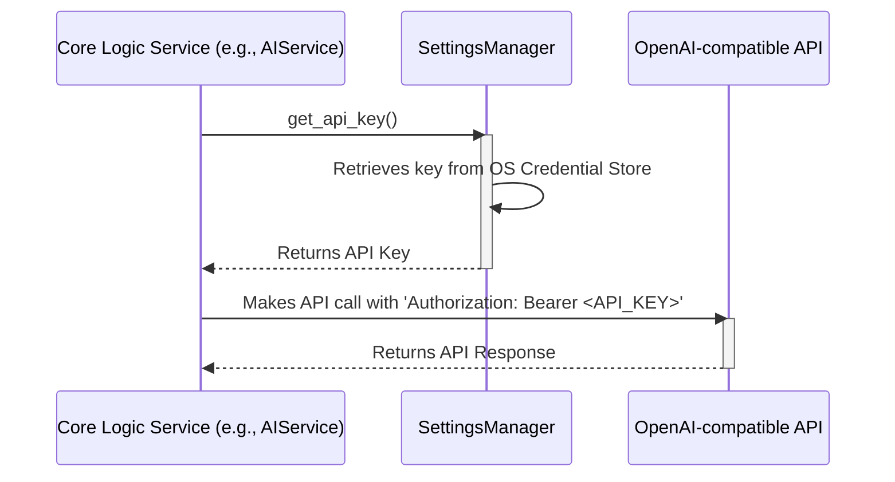

# Backend Architecture

## Service Architecture

The core logic is organized into a set of service classes, each with a distinct responsibility. This is analogous to a service layer in a traditional server application.

### Service/Controller Organization
The service classes will be organized into a `services` package within the `src/core` directory.

```plaintext
src/
└── core/
    ├── __init__.py
    ├── services/       # Business logic (Indexing, Search, AI)
    │   ├── __init__.py
    │   ├── indexing_service.py
    │   ├── search_service.py
    │   └── ...
    ├── data/           # Data models and data access layer
    │   ├── __init__.py
    │   ├── models.py       # Python dataclasses for Document, Chunk, etc.
    │   └── repositories.py # Repository classes for DB interaction
    └── utils/          # Core utility functions (e.g., chunking)
```

### Service Template
Each service will be a class that receives its dependencies (other services or repositories) through constructor injection. This promotes loose coupling and testability.

```python
# Example: src/core/services/search_service.py

from ..data.repositories import DocumentRepository, ChunkRepository
from .embedding_client import EmbeddingClient
from .vector_db_manager import VectorDBManager

class SearchService:
    def __init__(
        self,
        doc_repo: DocumentRepository,
        chunk_repo: ChunkRepository,
        embedding_client: EmbeddingClient,
        vector_db: VectorDBManager
    ):
        self.doc_repo = doc_repo
        self.chunk_repo = chunk_repo
        self.embedding_client = embedding_client
        self.vector_db = vector_db

    def search(self, query: str, top_k: int = 10) -> list[dict]:
        """
        Performs a semantic search and returns formatted results.
        """
        query_embedding = self.embedding_client.get_embedding(query)
        chunk_vector_ids = self.vector_db.search_vectors(query_embedding, k=top_k)

        # Retrieve chunk metadata from DB
        chunks = self.chunk_repo.get_chunks_by_vector_ids(chunk_vector_ids)

        # ... logic to enrich chunks with document metadata and format results
        formatted_results = []
        # ...
        return formatted_results
```

## Database Architecture

### Schema Design
The database schema is defined by the SQL DDL statements in the **Database Schema** section above. The schema includes tables for `documents`, `chunks`, `collections`, and the `document_collections` junction table.

### Data Access Layer (Repository Pattern)
To decouple the services from the database implementation (SQLite), we will use the Repository Pattern. A repository class will exist for each major data model and will encapsulate all SQL queries.

```python
# Example: src/core/data/repositories.py
import sqlite3
from .models import Document

class DocumentRepository:
    def __init__(self, db_connection: sqlite3.Connection):
        self.conn = db_connection

    def get_by_id(self, doc_id: int) -> Document | None:
        cursor = self.conn.cursor()
        cursor.execute("SELECT * FROM documents WHERE id = ?", (doc_id,))
        row = cursor.fetchone()
        # ... logic to map row to Document dataclass
        return Document(...) if row else None

    def save(self, document: Document) -> None:
        cursor = self.conn.cursor()
        cursor.execute(
            "INSERT INTO documents (...) VALUES (...)",
            (...)
        )
        self.conn.commit()
```

## Authentication and Authorization

Authentication and authorization are not applicable for user access to the application itself. The architecture only concerns itself with authenticating to external, third-party APIs using a user-provided key.

### Auth Flow (External API)
This diagram shows the flow when a service needs to make an authenticated call to the external OpenAI-compatible API.



### Middleware/Guards
This concept is handled in the UI layer. UI components like buttons ("Analyze with AI") will be enabled or disabled based on whether an API key has been configured in the `SettingsManager`. There is no backend middleware for this.
