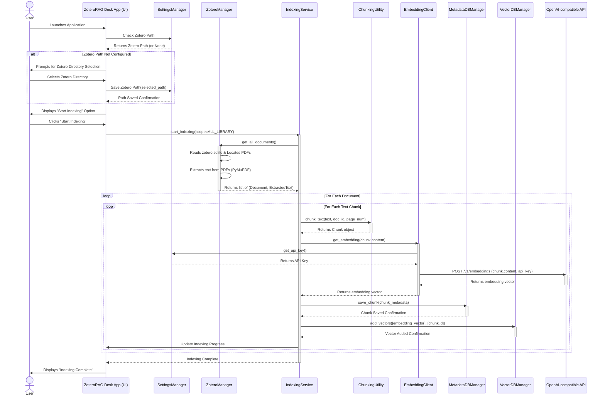

# Core Workflows

## Initial Setup & Indexing Workflow

```mermaid
sequenceDiagram
    actor User
    participant UI as ZoteroRAG Desk App (UI)
    participant SM as SettingsManager
    participant ZM as ZoteroManager
    participant IS as IndexingService
    participant CU as ChunkingUtility
    participant EC as EmbeddingClient
    participant MDM as MetadataDBManager
    participant VDM as VectorDBManager
    participant OAI as OpenAI-compatible API

    User->>UI: Launches Application
    UI->>SM: Check Zotero Path
    SM-->>UI: Returns Zotero Path (or None)

    alt Zotero Path Not Configured
        UI->>User: Prompts for Zotero Directory Selection
        User->>UI: Selects Zotero Directory
        UI->>SM: Save Zotero Path(selected_path)
        SM-->>UI: Path Saved Confirmation
    end

    UI->>User: Displays "Start Indexing" Option
    User->>UI: Clicks "Start Indexing"
    UI->>IS: start_indexing(scope=ALL_LIBRARY)
    activate IS

    IS->>ZM: get_all_documents()
    activate ZM
    ZM->>ZM: Reads zotero.sqlite & Locates PDFs
    ZM->>ZM: Extracts text from PDFs (PyMuPDF)
    ZM-->>IS: Returns list of (Document, ExtractedText)
    deactivate ZM

    loop For Each Document
        loop For Each Text Chunk
            IS->>CU: chunk_text(text, doc_id, page_num)
            activate CU
            CU-->>IS: Returns Chunk object
            deactivate CU

            IS->>EC: get_embedding(chunk.content)
            activate EC
            EC->>SM: get_api_key()
            SM-->>EC: Returns API Key
            EC->>OAI: POST /v1/embeddings (chunk.content, api_key)
            activate OAI
            OAI-->>EC: Returns embedding vector
            deactivate OAI
            EC-->>IS: Returns embedding vector
            deactivate EC

            IS->>MDM: save_chunk(chunk_metadata)
            activate MDM
            MDM-->>IS: Chunk Saved Confirmation
            deactivate MDM

            IS->>VDM: add_vectors([embedding_vector], [chunk.id])
            activate VDM
            VDM-->>IS: Vector Added Confirmation
            deactivate VDM

            IS->>UI: Update Indexing Progress
        end
    end

    IS-->>UI: Indexing Complete
    deactivate IS
    UI->>User: Displays "Indexing Complete"
```
