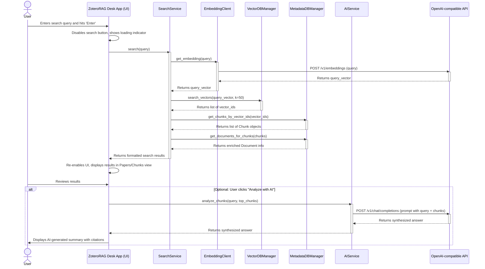

# Development Workflow

## Coding Standards

All code contributions must adhere to the guidelines specified in the `CONTRIBUTING.md` file located in the root of the repository. This document details our standards for code formatting (`black`), linting (`ruff`), type hinting, and docstrings. Before submitting any code, please ensure it complies with these standards.

## Local Development Setup

### Prerequisites
```bash
# Ensure Python 3.13 is installed
python3 --version
# Ensure Git is installed
git --version
```

### Initial Setup
```bash
# 1. Clone the repository
git clone https://github.com/your-org/zotero-rag-desk.git
cd zotero-rag-desk

# 2. Create and activate a Python virtual environment
python3.13 -m venv .venv
source .venv/bin/activate  # On Windows: .venv\Scripts\activate

# 3. Install project dependencies using poetry (or pip if poetry not used)
# Assuming pyproject.toml is configured for poetry or pip
pip install poetry # If poetry is not installed
poetry install     # Or: pip install -e .
```

### Development Commands
```bash
# Start all services (runs the main PySide6 application)
python -m zoterorag

# Start frontend only (same as starting all services for this monolithic app)
python -m zoterorag

# Start backend only (not applicable, core logic runs within the main app)
# N/A

# Run tests
pytest src/tests/
```

## Environment Configuration

### Required Environment Variables
Environment variables are primarily used for development-time flags or sensitive information that should not be hardcoded. For user-specific settings like API keys or Zotero paths, the `SettingsManager` component handles secure local storage.

```bash
# Frontend (.env.local) - Not directly applicable for PySide6, managed by SettingsManager
# N/A

# Backend (.env) - Not directly applicable, managed by SettingsManager
# N/A

# Shared (can be set in shell or via .env file loaded by a tool like python-dotenv for dev)
# ZOTERORAG_DEBUG=True
# Purpose: Enables verbose logging and debug features during development.
```

## Search and AI Analysis Workflow

This workflow describes how a user performs a search and optionally uses the AI analysis feature.


